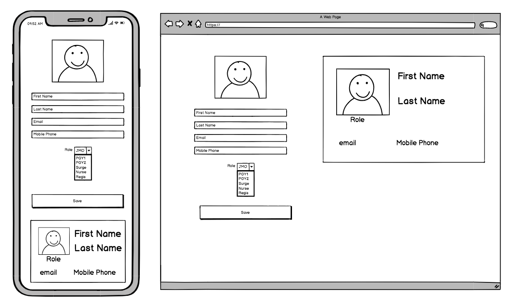

# Med Apps Code Test


## Challenge 1 - allow for 1 1/2 - 2 1/2 hours

Doctors at Finegrove Medical practice have started to rollout Standardised E-Passes at their hospital to help Identify staff, with a large cohort of JMOs (Junior medical doctors) coming very soon. Finegrove would like to automate the creation of the passes

The IT team at finegrove has shared a wireframe of what they would like to capture. 

The JMO's will receive a welcome SMS with a link to a web app. They can complete the details to create an E-Pass.



### Requirements

- Create a form complete with live preview of the users details 
- Email address is validated and every field is required
- The app should be responsive to work on a mobile device

Allow the app to use the filesystem api to read a local file for drag and drop. To then be displayed in an image preview.

Submitting the form at this initial stage is not necessary, ensure the data is valid so that it can be wired up with a backend.

> Use any front end libraries or frameworks of your choice

> tight for time? no problem do not worry about styling the application too much, keep it functional. We are more interested in your structure and decisions.

> put your challenge into challenge-1 directory and provide clear instructions on how to setup and run your solution

# Challenge 2 - allow for 1hr ( optional extra test )

The IT team at finegrove has decided to pass the API over to medapps due to lack of resources. We now need to connect the E-Passes app (challenge 1) to the API, its got a few bugs with it.

Get the api up and running saving employee data.

`cd challenge-2`

> You can use the swagger page at: /documentation to test

Endpoints to check and fix. 

```
GET /employees/{id}
GET /employees?role=JMO
POST /employees
```

> Note you shouldn't need to touch Employee.js
